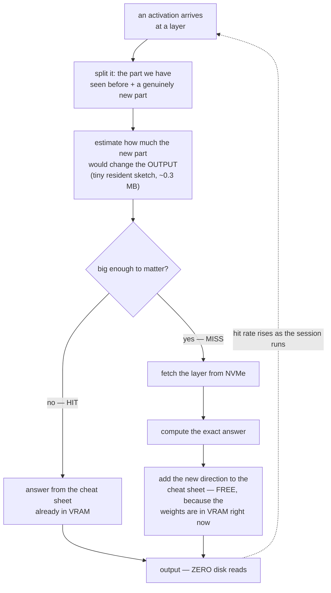
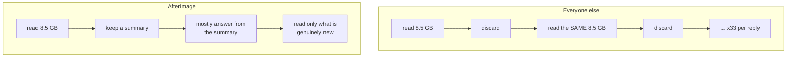
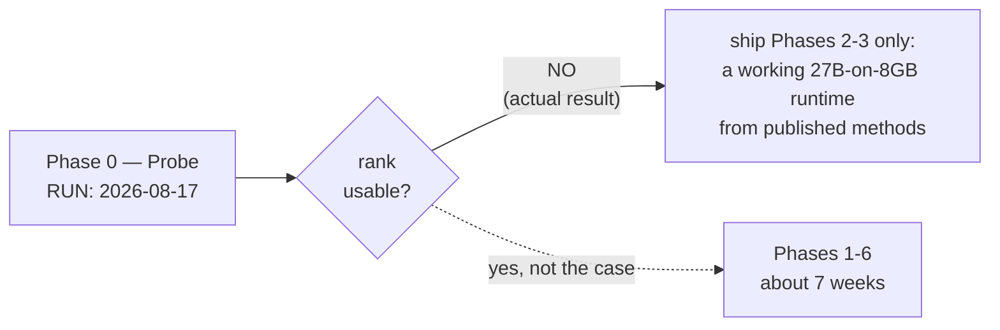

# Afterimage

**Run a 27B model on an 8 GB GPU by caching what the weights *did*, not the weights.**

> Status: **tested against a real model on real GPU hardware — result: NO-GO.**
> Phase 0 ran on 2026-08-17 against Qwen2.5-1.5B-Instruct on an RTX 3080 via
> CUDA: functional error at rank 256 (2.9% of a real layer's width) was
> 25-45%, against a success threshold of <0.1% — roughly 250-450x too high.
> End-to-end closed-loop error with several layers truncated was 60-96% even
> at rank 128. **Full data: [docs/PHASE0_RESULTS.md](docs/PHASE0_RESULTS.md).**
> The mechanism itself (exact reproduction from a learned subspace,
> output-space gating without fetching weights, fetch-once batched
> verification, the speculative-sampling exact-distribution guarantee) is
> implemented correctly and passes 67 tests — several real bugs were caught
> along the way, including during the real-model run — but the workload it
> was built for does not have enough exploitable structure. Per the plan
> written *before* this measurement, a failed gate means stop, not scale up
> and recheck: **the recommended path forward is the fallback** (residency +
> speculation, no cache) — see
> [IMPLEMENTATION_STATUS.md](IMPLEMENTATION_STATUS.md).

---

## The problem

A 27B model at Q4 is about 16 GB. A consumer GPU has 8 GB. The weights do not fit,
so they have to be streamed from somewhere slower every time you want a token.

## The one-paragraph idea

Every existing system reads the model from disk, uses it, and then **throws away
everything it just learned.** Next token, it reads the same bytes again. Across a
500-token reply the same 8.5 GB gets read about 33 times — 280 GB of traffic to
move 8.5 GB of information.

Afterimage keeps a cheat sheet instead. And there is a mathematical reason a small
cheat sheet can work: **a model's layers are linear machines.** For a linear
machine, if every question you ask is a blend of a few hundred basic questions,
then memorising the answers to those basic questions lets you answer *infinitely
many* blended questions exactly. That is a theorem, not a compression heuristic.

> **You are not running a 27B model. You are running the 27B model's restriction
> to your conversation.**

---

## How it works



Three properties nothing else in the literature has:

| | |
|---|---|
| **The cache fills itself for free** | The only time you need the weights is a miss — which is exactly the moment they are already loaded. Extending the cheat sheet costs one extra matrix multiply and **zero additional I/O**. No calibration pass, no training. |
| **It gets faster the longer you talk** | Miss rate falls monotonically as the basis learns your session. Quantization, sparsity and speculation all cost the same forever. |
| **Being wrong self-corrects** | An unfamiliar input is a miss; a miss computes the exact answer and enlarges the cache. Compare offline-calibrated methods, which silently degrade on inputs they were not calibrated for. |

---

## How this differs from what exists



Speculative decoding (SpecExec, SubSpec) amortises one read across ~15 tokens in a
single sweep — then discards it. Afterimage keeps the value of that read
permanently, at roughly a tenth of the size. **They are complementary**, and
Afterimage is designed to sit on top of a SubSpec-class system rather than replace
it.

Full survey with diagrams of AirLLM, FlexGen, SpecExec, SubSpec and ATSInfer:
**[docs/LITERATURE.md](docs/LITERATURE.md)**

---

## Honest status

This is a bet, and the evidence currently runs against it.

The idea needs your conversation's activations to be blends of a few hundred basic
directions. The published measurements are unfavourable:

- **Residual streams measure ~90% effective rank** ([arXiv:2508.16929](https://arxiv.org/pdf/2508.16929)) — and the residual stream is precisely what feeds every linear layer.
- The most favourable published figure is `r = d/4`, i.e. about **4×**, not the 10–40× the idea wants.
- A random-matrix analysis finds the *smallest* singular values can be the second-most-important decile — so the innocuous-looking directions are not innocuous.
- Activation-aware low-rank compression (ASVD, IO-SVD) achieves only 10–30%.

**The one real counterargument:** all of those are *corpus-level* measurements.
This cache is **per-session**, and within-session effective rank has never been
published. Measuring it is Phase 0 — two days, forward hooks and numpy, no
inference engine required. That measurement is worth publishing whatever it says.

**Realistic expectation: 1.5–3× on top of a SubSpec-class system, possibly ~1×.**
Earlier drafts of this document implied 10×+; that was not supported.

---

## Code

A working implementation of the mechanism exists at `afterimage/`. Originally
built and tested against a synthetic model (no GPU available at the time);
later brought up on real CUDA hardware (WSL2 + RTX 3080) specifically to run
Phase 0 for real — see [docs/EXECUTION_PLAN.md](docs/EXECUTION_PLAN.md) Stage
A for how, and [IMPLEMENTATION_STATUS.md](IMPLEMENTATION_STATUS.md) for the
full component-by-component record, including five real bugs the synthetic
tests could not have caught:

```
pip install -e .
pytest tests/ -v                         # 67/67 passing
python scripts/run_probe_demo.py         # the rogue-dimension gap, on the toy model
python scripts/run_engine_demo.py        # draft + cache + verify, end to end, toy model
python scripts/run_probe_real.py         # Phase 0 for real -- needs CUDA + transformers
```

`run_engine_demo.py`'s toy-model output turned out to be an accurate small-scale
preview: on an unstructured vocabulary the cache hit rate is 0%; forcing a
low-rank embedding gets the first layer to 90% hits but it collapses to 0% one
layer later, because GELU and LayerNorm expand rank with depth even from a
low-rank input. The real-model run confirmed the same shape of problem at
production scale (§ below).

**[IMPLEMENTATION_STATUS.md](IMPLEMENTATION_STATUS.md)** is the file to read
if you're deciding whether to trust a specific claim.

---

## Phase 0 — run for real, result: NO-GO

Ran 2026-08-17 against Qwen2.5-1.5B-Instruct on an RTX 3080 (WSL2/CUDA),
across 4 real workloads (focused code, multi-turn chat, long-form prose, and
a deliberately adversarial topic-switching mix) and 6 layers spread across
depth. **[Full data and reasoning: docs/PHASE0_RESULTS.md](docs/PHASE0_RESULTS.md).**

| Metric | Threshold (Go) | Measured | Verdict |
|---|---|---|---|
| Functional error at rank 256 (2.9% of layer width) | < 0.1% | 25–45% | ~250–450x too high |
| End-to-end closed-loop error, rank 128, 6 layers truncated | near 0 | 60–96% | catastrophic |

The rogue-dimension effect the hypothesis predicted is real and measurable —
variance-captured hit 82–99% at rank 256 while functional error stayed at
25–45% for the *same* rank, confirming variance is the wrong criterion. And
the effective-rank ordering across workloads matched prediction (long-form
prose lowest, adversarial topic-switching highest, 4x apart). **The mechanism
is sound. The absolute scale is not there:** even the most favorable workload
needs ~2.5% of a layer's width just to describe itself, leaving almost no
budget for the cache to compress further.

Per the plan written *before* this measurement ran (HYPOTHESIS.md §6,
EXECUTION_PLAN.md §6.1): **a failed gate means stop, not scale up and
recheck.** The recommended path forward is the fallback below, which was
never dependent on this cache working.

---

## Plan



The plan was ordered by risk retired per hour, not build order, so the
Phase 0 measurement would gate everything else before committing to a
multi-week build. It did: Phase 0 failed, so Phases 2–3 (residency +
speculation, published methods, no novelty claim) are the product going
forward — that was always the honest fallback, and it is unaffected by the
cache's result.

Full detail, benchmark methodology, test matrix and the traps that would produce
false results: **[docs/IMPLEMENTATION_PLAN.md](docs/IMPLEMENTATION_PLAN.md)**

---

## Documents

| | |
|---|---|
| [docs/HYPOTHESIS.md](docs/HYPOTHESIS.md) | the mathematics, the theory, and the honest risk register |
| [docs/LITERATURE.md](docs/LITERATURE.md) | survey through Aug 2026 with diagrams of each approach |
| [docs/IMPLEMENTATION_PLAN.md](docs/IMPLEMENTATION_PLAN.md) | build order, benchmarks, tests, success thresholds |
| [IMPLEMENTATION_STATUS.md](IMPLEMENTATION_STATUS.md) | what's actually built, tested, and run vs. stubbed or unbuilt |

---

## Name

"Afterimage" — what persists after the light has passed through. The cache is the
impression the weights leave behind on the activations that went through them.

Checked as unused in the LLM-inference space (Aug 2026). Rejected: *PocketLLM*
(4+ existing projects), *CompactFit* (existing memory-management system),
*Cairn* (3 existing projects).
