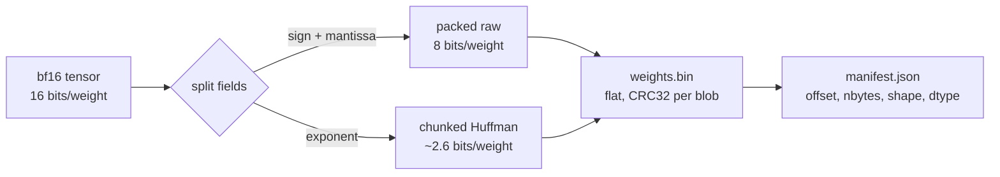
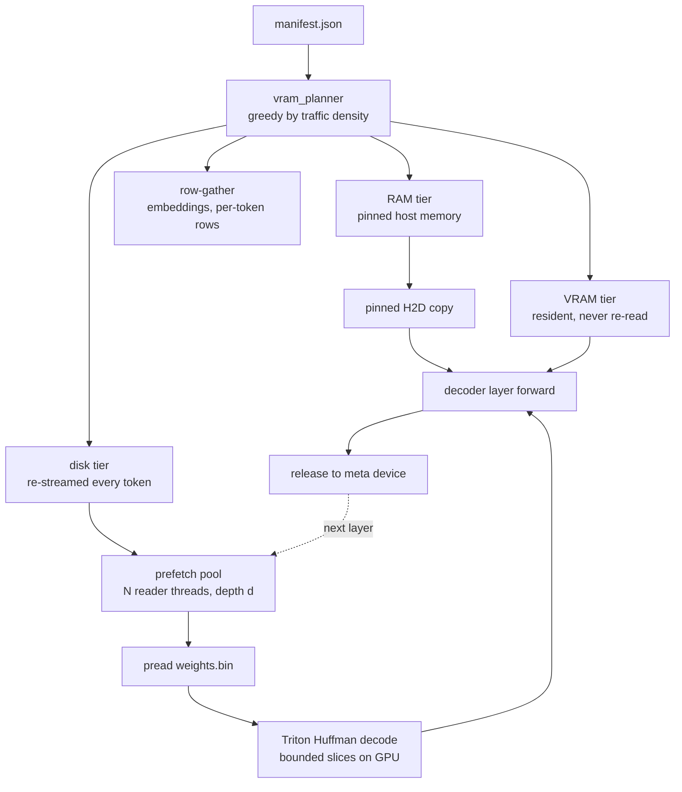
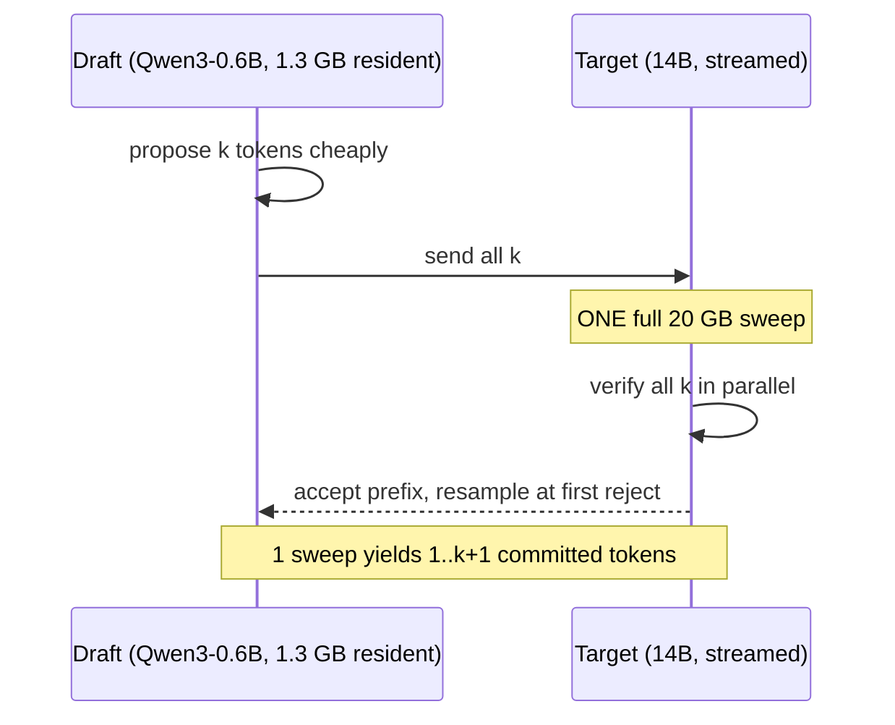
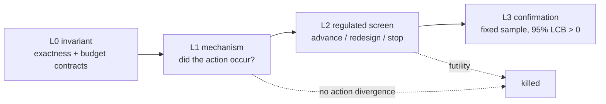

# Afterimage

**Run a model larger than your VRAM, losslessly — and pick your own point on
the memory/speed curve.**

Afterimage entropy-codes bf16 weights (exact, 1.453x measured) and streams them
layer-by-layer from a compressed on-disk store. That much is
[ZipNN](https://arxiv.org/abs/2411.05239)'s codec plus
[AirLLM](https://github.com/lyogavin/airllm)'s execution model, and on its own
it buys nothing. What Afterimage adds is a **dial**: spend spare VRAM on
residency and speculation to go 3x faster, or give up bit-exactness to go 43%
lower on memory.

Alongside the engine is an opt-in **research layer** — 16 preregistered
hypotheses (H0–H15), each with a kill gate, measured on real hardware. *None of
them has passed.* That result is the point of this section of the repo, and it
is reported here rather than buried.

> **Status:** working engine, measured against AirLLM on an RTX 3080 Laptop.
> Current evidence: [the bounded research report](docs/BOUNDED_RESEARCH_REPORT_2026-08-21.md).

---

## Measured, not projected

Qwen3-14B (29.5 GB bf16) on 8 GB of VRAM, WSL2/CUDA, cold page cache,
4 held-out prompt families × 4 forced greedy tokens, every system on the same
`torch.cuda.max_memory_allocated()` counter:

| Configuration | Peak VRAM | s/token | Exact | vs AirLLM |
|---|---:|---:|:---:|---:|
| **AirLLM 3.1.0** (reference) | 1.58 GB | 28.86 | yes | 1.00x |
| Minimum-memory exact | 1.72 GB | 32.51 | yes | **0.89x** |
| + 4 GB residency | 3.93 GB | 17.36 | yes | **1.66x** |
| + fixed-k speculation | 3.81 GB | **9.15** | yes at T=0 | **3.15x** |
| Chunked head (opt-in) | **0.90 GB** | 29.61 | **no** | 0.97x |

**At AirLLM's memory floor we are 11% slower.** Compression alone trades disk
time for decode time and comes out behind. The wins are bought with memory
(1.66x) or with speculation (3.15x); the memory win (−43% VRAM at parity speed)
is bought by giving up bit-exactness. Single-run point estimates — the measured
noise band is ±4%, so anything under ~10% means parity.

---

## How it works

### 1. The store — split bf16 into a raw field and a compressible one

A bf16 word is `[sign:1][exponent:8][mantissa:7]`. Mantissa entropy measures
6.97 of 7 bits — incompressible. The exponent measures ~2.6 bits of 8. So
Afterimage packs sign+mantissa into one raw byte and Huffman-codes only the
exponent, in 1024-element chunks so the GPU can decode them in parallel.



Reconstruction ORs the decoded exponent back into bits 7–14; the fields never
overlap, so it is exact by construction, not approximately exact. Measured
1.453x against a proven ceiling of ~1.51x — **96% of what is information-
theoretically available for bf16.** There is no headroom left here.

### 2. The runtime — plan once, then stream

Every weight is touched exactly once per token, so "importance" cannot rank
residency. What differs is **bus traffic avoided per byte of VRAM spent**:
`compressed_bytes / original_bytes`. A tensor that compresses *badly* costs the
most re-streaming, so it is pinned first — counterintuitive, and only visible
once compression is on the streaming path.



The prefetch pool reads layer *i+1…i+d* while layer *i* decodes and computes.
`vram_budget_gb` is the dial: infeasible budgets are **refused up front**, never
silently approximated.

### 3. Speculation — amortise the sweep, not the bytes

Producing one token means reading the whole 20 GB store. Residency and
compression attack *bytes per read*. Speculation attacks the **numerator —
reads per token** — which is why it is the largest win here.



Acceptance is `min(1, p_target/p_draft)`; on rejection the token is resampled
from the residual. The output distribution is provably the target's, so **the
draft can only change speed, never correctness.** A bad guess costs a wasted
draft token; it can never produce a wrong one.

This is standard draft/verify from the literature — and speculation over an
*offloaded* target is already established by
[SpecExec](https://arxiv.org/abs/2406.02532) (NeurIPS 2024). The contribution
here is that it composes with compression, residency and the chunked head.

---

## The dial

```python
from afterimage.runtime.config import EngineConfig
from afterimage.runtime.streaming_engine import StreamingLosslessModel, load_draft_model

cfg = EngineConfig(
    vram_budget_gb=4.0,      # the dial; refused up front if infeasible
    ram_budget_gb=8.0,       # pinned host RAM as a second, faster-than-disk tier
    draft_mode="model",      # "none" | "model" | "self"
    spec_k=8,                # draft chain length
    lm_head_slice_rows=0,    # >0 drops the VRAM floor ~1.4 GB -- NOT lossless
)
sm = StreamingLosslessModel("Qwen/Qwen3-14B", store_dir, device="cuda", config=cfg)
draft = load_draft_model("Qwen/Qwen3-0.6B", device="cuda")
seq, _ = sm.generate_adaptive(input_ids, max_new_tokens=64, draft_model=draft)
```

`EngineConfig.is_lossless` is `False` whenever `quantize="q8"` or
`lm_head_slice_rows > 0`, and `describe()` says so explicitly. No run using
either may be reported as bit-exact.

**Why the chunked head is not exact.** `logits[..., a:b] = x @ W[a:b].T` has no
interaction between vocabulary blocks, so the head can be computed one block at
a time and never held whole. But blocking changes the matmul reduction order
and cuBLAS picks a different kernel per output shape, so bf16 rounding diverges
(1–2 absolute in logits). Padding blocks to a fixed size does *not* fix it:
`N=1024` is exact at sequence length 1 and wrong at 5, and sequence length
changes on every speculative sweep. This is a real limit, not an unfinished
task.

---

## Install & run

```bash
./install.sh                                  # Linux / WSL2 -- detects GPU, sets up venv
pip install -e ".[gpu,server]"                # or by hand
afterimage doctor
afterimage compress Qwen/Qwen3-14B            # one-time, ~6 min on 16 cores
afterimage run Qwen/Qwen3-14B "The capital of France is" --vram-budget-gb 4
afterimage serve                              # OpenAI-compatible API + web UI on :8420
```

```powershell
.\install.ps1                                 # Windows (native CUDA)
```
```bash
docker compose up                             # needs the NVIDIA Container Toolkit
```

`afterimage serve` exposes `/v1/chat/completions`, job control
(`/api/compress`, `/api/jobs/{id}`, pause/resume/cancel), `/api/plan` for
budget feasibility, and an **Experiment Lab** that runs the H0–H15 candidates
against named controls without touching engine defaults.

Research commands: `afterimage experiments --json` (registry),
`afterimage test-plan h12-bayesian-prefetch` (evidence protocol),
`afterimage profile-trace` (measured critical-path profile),
`afterimage optimize-residency` (offline plan search),
`afterimage pin-preflight` (prove pinned-RAM experiments can allocate).

---

## The research layer: 16 hypotheses, 0 passed

Each hypothesis is a named method profile with a preregistered gate and a kill
criterion. Evidence is graded L0–L3 — an exploratory screen is never promoted
into a confirmation because its point estimate looked good.



| ID | Method | Measured | Gate | Verdict |
|---|---|---:|---:|---|
| H0 | Joint semantic/system oracle gap | +2.56% | 12% | **gate closed** — kills H3/H8 |
| H1 | Event-DAG critical-path residency | +1.61% | 8% | below gate |
| H2 | Cost-aware rejection-hazard stopping | −6.4% | 8% | not supported |
| H3 | Baseline-guarded contextual bandit | not run | — | correctly gated by H0 |
| H4 | PI / MPC feedback prefetch | −35.7% | 5% | rejected |
| H5 | Certified greedy MIPS output head | −30.5% | 8% | killed (0.084% rows pruned) |
| H6 | Exact per-tensor representation DP | — | 10% | untested (no alt artifacts) |
| H7 | Expert-local XOR reference coding | — | 10% | N/A (Qwen3-14B is dense) |
| H8 | Simulator-based profile control | not run | — | correctly gated |
| H9 | Liveness-guided lm_head RAM overlay | +1.9% | 10% | pinning blocked (64 MB memlock) |
| H10 | Digital-twin CEM residency search | +2.1% | 8% | below gate |
| H11 | Tiny censored-survival spec stopping | +9.5% dir. | 8% | **zero stop decisions** — failed L1 |
| H12 | Bayesian probit prefetch depth | +2.23% | 5% | below gate, wait got worse |
| H13 | Event-interference QUBO residency | no divergence | 5% | optimizer returned its control |
| H14 | Coalesced contiguous storage reads | **−27.7%** | 5% | stop for futility |
| H15 | Physical-extent QUBO residency | no divergence | 2% | blocked at mechanism gate |

Two of these are worth reading closely. **H14** cut storage read calls by 89%
with zero byte amplification and got *27.7% slower* — a large contiguous read
serialises against decode instead of overlapping with it. **H11 and H13/H15**
both failed the mechanism prerequisite rather than the performance gate: the
controller never took a different action from its control, so the timing
direction cannot be credited to the method at all.

- **Where each idea came from, verified against the sources:**
  [docs/HYPOTHESIS_LINEAGE.md](docs/HYPOTHESIS_LINEAGE.md)
- **Protocols, configuration and kill gates:**
  [docs/RESEARCH_METHODS.md](docs/RESEARCH_METHODS.md)
- **Evidence levels and current interpretation:**
  [docs/REGULATED_TEST_PLAN_2026-08-21.md](docs/REGULATED_TEST_PLAN_2026-08-21.md)

**Tried and correctly killed earlier:** self-drafting with an *untrained* model
(0% acceptance), a live bandit tuning draft length (never beat a tuned
constant), CPU/GPU split decode (passed its isolated throughput gate, then made
the engine 0.52x once integrated). Full reasoning:
[docs/RESULTS_LOG.md](docs/RESULTS_LOG.md).

---

## What will never be claimed

- No lossless bf16 ratio above ~1.51x — proven impossible, not a current limit.
- No "lossless" label on any run using `quantize="q8"` or `lm_head_slice_rows > 0`.
- No speed or memory number that was not measured on real hardware with a cold
  cache, on the same counter as whatever it is compared against.
- No "faster than AirLLM" claim without stating whether VRAM was matched.
- **No novelty claim.** The codec is ZipNN's, offloaded speculation is
  SpecExec's, adaptive draft stopping is crowded (AdaEDL, SpecDec++,
  BanditSpec, PEARL, PACER), and branch-and-bound MIPS predates all of it. The
  defensible contribution is an engineering artifact with an honest Pareto map
  and a pile of negative results.

---

## Prior phase (archived, not deleted)

An earlier phase explored caching a linear layer's *outputs* for previously-seen
activation directions. Real math, 67 tests, correctly killed after a real-model
measurement came in 250–450x above the success threshold. Code kept and marked
archived in its own docstrings; history in [docs/archive/](docs/archive/).

---

## Documents

| | |
|---|---|
| [docs/HOW_IT_WORKS.md](docs/HOW_IT_WORKS.md) | method-by-method walkthrough next to AirLLM |
| [docs/BOUNDED_RESEARCH_REPORT_2026-08-21.md](docs/BOUNDED_RESEARCH_REPORT_2026-08-21.md) | **current evidence** — protocol, verdicts, novelty audit |
| [docs/REGULATED_TEST_PLAN_2026-08-21.md](docs/REGULATED_TEST_PLAN_2026-08-21.md) | L0–L3 evidence levels and per-family protocols |
| [docs/RESEARCH_METHODS.md](docs/RESEARCH_METHODS.md) | H0–H15 hypotheses, configuration, tests, kill gates |
| [docs/HYPOTHESIS_LINEAGE.md](docs/HYPOTHESIS_LINEAGE.md) | where each hypothesis came from, with verified citations |
| [docs/NOVEL_METHODS_2026-08-21.md](docs/NOVEL_METHODS_2026-08-21.md) | H9–H13 method designs and literature boundaries |
| [docs/RESULTS_LOG.md](docs/RESULTS_LOG.md) | append-only ledger of measured runs, regressions and corrections |
| [docs/LITERATURE.md](docs/LITERATURE.md) | survey — lossless codecs, offloading, adaptive speculation, RL for systems |
| [results/](results/) | immutable run JSON; schema and publication rules in its README |
| [docs/archive/](docs/archive/) | superseded planning docs, kept for traceability |

---

*Apache-2.0. "Afterimage" — what persists after the light has passed through.*
