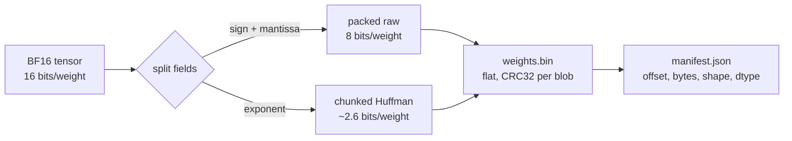
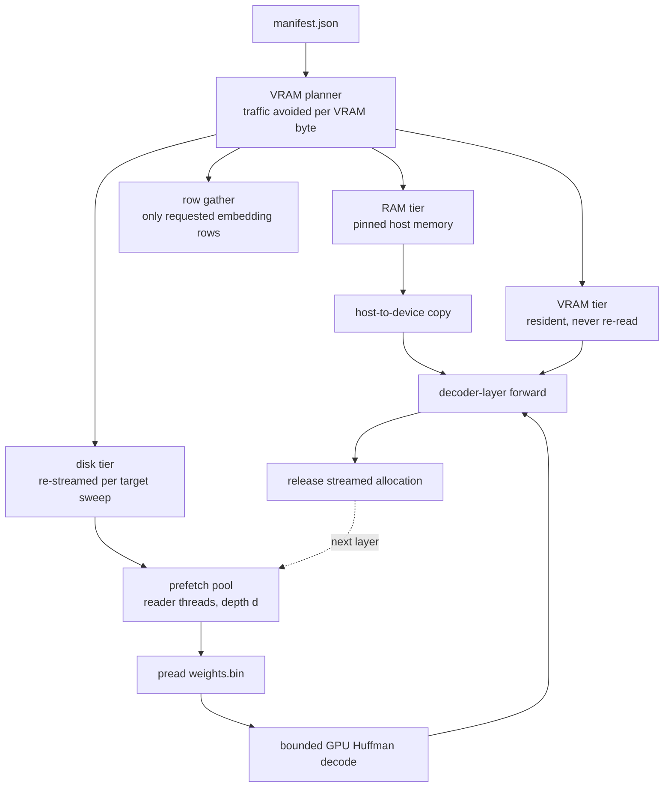
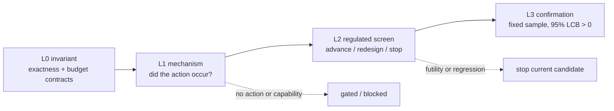

# Afterimage architecture

<p align="center">
  
</p>

Afterimage runs a model that is larger than available VRAM by keeping its exact
BF16 weights in a compressed store, assigning tensors to a memory tier, and
materializing streamed weights only for the layer currently executing. This
page contains the system and research-flow diagrams; the top-level README stays
focused on capabilities, measured results, and the quick start.

For the measurement-backed explanation of each method, see
[HOW_IT_WORKS.md](HOW_IT_WORKS.md). For implementation details and experiment
contracts, see [RESEARCH_METHODS.md](RESEARCH_METHODS.md).

## Lossless weight store

A BF16 word contains a sign bit, eight exponent bits, and seven mantissa bits.
The mantissa is nearly incompressible in the measured checkpoint, so Afterimage
stores sign plus mantissa as a raw byte and Huffman-codes the exponent in bounded
chunks. Reconstruction combines disjoint fields and is bit-exact.



The measured Qwen3-14B store is 20.3 GB instead of 29.5 GB, a 1.453x exact
compression ratio. The manifest makes every blob addressable without loading
the complete store.

## Memory tiers and streamed execution

The planner assigns tensors to VRAM, pinned host RAM, disk, or row-gathered
embedding access under explicit budgets. Disk-tier tensors are prefetched while
the previous layer decodes and computes. Once a streamed layer finishes, its
temporary allocation is released before the next one is materialized.



`vram_budget_gb` and `ram_budget_gb` define the operating point. The feasibility
planner rejects a configuration that cannot satisfy its declared exactness and
memory contract instead of silently choosing an approximate fallback.

## Speculative decoding

For a streamed target, the dominant unit of work is a complete pass through the
weight store. A small resident draft model proposes several tokens; the target
verifies the chain in one streamed pass. Rejection sampling preserves the
target distribution, while a good draft amortizes one expensive sweep across
multiple committed tokens.

```mermaid
sequenceDiagram
  participant D as Draft model (resident)
  participant T as Target model (streamed)
  D->>D: propose k tokens cheaply
  D->>T: submit the candidate chain
  Note over T: one complete weight-store sweep
  T->>T: verify k positions in parallel
  T-->>D: accept prefix; resample first rejection
  Note over D,T: one sweep commits 1..k+1 tokens
```

Fixed speculative decoding is the strongest measured full-suite operating
point. Adaptive stopping policies remain experiments and do not replace the
fixed default unless their registered evidence gate is met.

## Research evidence flow

The experiment lab separates invariant checks, mechanism checks, bounded
screens, and confirmation. A result cannot be called a performance failure if
the candidate never took a different action, the host lacked a required
capability, or the checkpoint did not contain the required structure.



The current H0–H18 interpretation is summarized in the
[README](../README.md#research-status-mixed-evidence-no-l3-confirmation), with
the controlling measurements in
[FINAL_TEST_RESULTS_2026-08-21.md](FINAL_TEST_RESULTS_2026-08-21.md).

## Main implementation boundaries

| Area | Primary modules | Responsibility |
|---|---|---|
| Store | `compressed_store.py`, `huffman_chunked.py`, `layout.py` | Exact encoding, manifests, checksums, and physical layout |
| Planning | `vram_planner.py`, `resident.py`, `tiers.py` | Budget feasibility and tensor placement |
| Streaming | `streamer.py`, `streaming_engine.py`, `gpu_decode.py` | Prefetch, decode, transfer, execution, and release |
| Speculation | `draft.py`, `spec_policy.py`, `controllers.py` | Draft generation, exact verification, and opt-in policies |
| Measurement | `bench/`, `experiments.py`, `scripts/run_regulated_pair.py` | Paired runs, evidence metadata, and immutable result output |
| Service | `server/app.py`, `server/jobs.py`, `server/static/` | OpenAI-compatible API, job control, and experiment UI |
