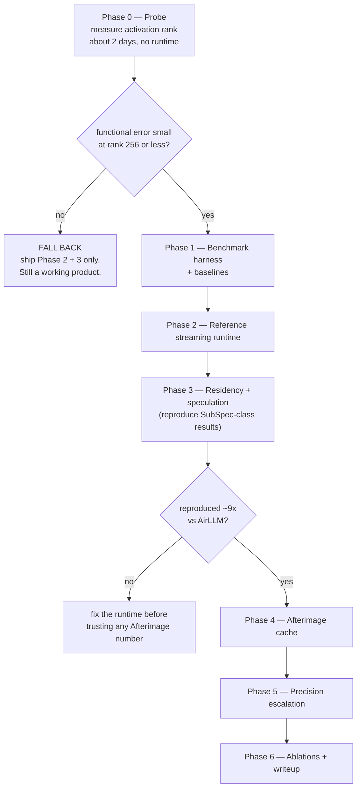
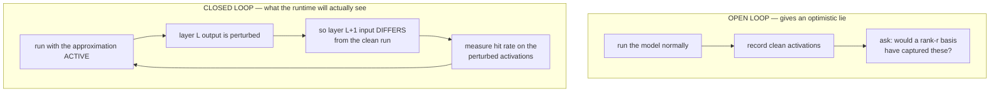
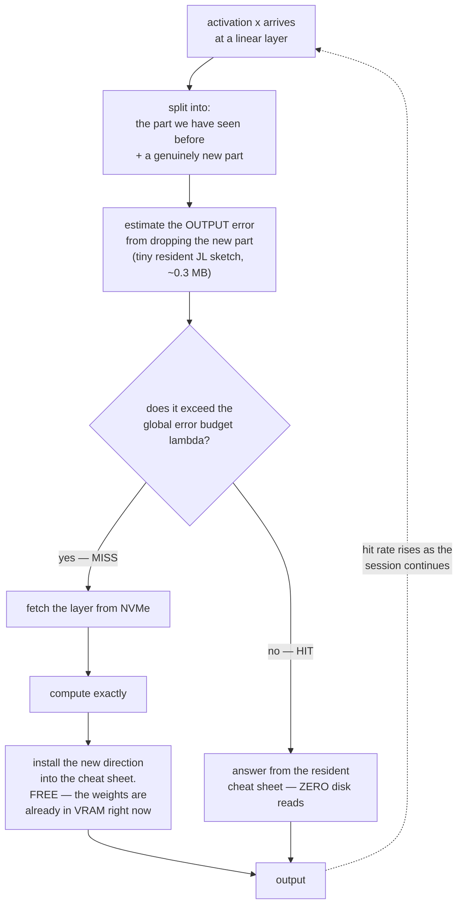

# Afterimage — Implementation & Testing Plan

Companion to [HYPOTHESIS.md](HYPOTHESIS.md) and [LITERATURE.md](LITERATURE.md).

**Governing principle:** the hypothesis is currently *unfavoured* by the
published evidence on activation rank (HYPOTHESIS §6.2). So the plan is ordered
by **risk retired per hour spent**, not by build order. Phase 0 can kill the
project in a day and requires no runtime at all. Nothing expensive gets built
until it passes.



---

## 0. Target hardware and models

Fix these before writing code; every number in the project is meaningless
without them.

| | Primary rig | Secondary (portability check) |
|---|---|---|
| GPU | RTX 4060 8 GB (or 3070 8 GB) | RTX 3060 12 GB |
| Host RAM | **16 GB** | 32 GB |
| Storage | PCIe 4.0 NVMe, ~5–7 GB/s seq read | SATA SSD, ~0.5 GB/s |
| OS | Linux (primary — needed for cache control) | Windows 11 |

**Models.** Gemma-3-27B and Qwen3-32B at Q4 as targets; Llama-3.2-1B and
Qwen3-0.6B as external drafts. Include a **small proxy model** (Qwen3-1.7B) for
fast iteration — most of Phase 0 and all correctness tests run on the proxy.

**Record actual architecture dimensions from the checkpoint** — `d_model`,
`d_ffn`, `n_layers`, `n_kv_heads` — into `configs/models.yaml`. The sketch-size
arithmetic in HYPOTHESIS §3.6 is currently derived from assumed dimensions and
must be recomputed from real config before anyone quotes it.

---

## 1. Repository layout

```
afterimage/
  probe/                  # Phase 0 — pure measurement, no runtime
    hooks.py              # forward hooks, activation capture
    basis.py              # online basis: MGS + reorthogonalisation
    spectra.py            # singular spectra, effective rank, functional error
    closed_loop.py        # closed-loop replay harness  <-- the important one
  runtime/
    tiers.py              # VRAM / pinned RAM / NVMe storage abstraction
    layout.py             # on-disk weight layout, bit-plane ladder
    streamer.py           # async layer streaming, double buffering, CUDA streams
    resident.py           # residency planner
    sketch.py             # the Afterimage cache
    gate.py               # JL norm estimator + global lambda controller
    draft.py              # SubSpec-style substitute draft
    verify.py             # tree construction + speculative verification
    engine.py             # decode loop
  baselines/
    b0_hf_offload.py      # HF accelerate disk offload
    b1_airllm.py          # AirLLM wrapper
    b2_llamacpp.py        # llama.cpp partial offload wrapper
    b3_sequential.py      # our own controlled AirLLM-equivalent
  bench/
    iocount.py            # OS-level byte accounting
    cachectl.py           # page-cache control (see §4.1 — critical)
    harness.py            # run matrix, repetition, statistics
    report.py             # tables + plots
  tests/
  configs/
```

**Why `b3_sequential.py` exists.** AirLLM is the headline comparison, but it is a
different codebase with a different I/O path, tokenizer handling, and kernel set.
Comparing against it alone confounds "our method is better" with "our engine is
better." `b3` is *our* streamer with residency, speculation, and the cache all
disabled — an apples-to-apples control. **Report both.** If Afterimage beats b3
but not AirLLM, we have an engineering problem, not a method.

---

## 2. Phase 0 — the Probe (kill switch)

**Goal:** measure the within-session functional rank of activations. Nobody has
published this. It decides the project.

### 2.1 What to measure

For each linear layer `ℓ`, maintain the online basis exactly as the runtime would
(HYPOTHESIS §2), and record per token:

| Quantity | Why |
|---|---|
| `σ` spectrum of the activation matrix | the raw n-width picture |
| `‖x⊥‖ / ‖x‖` | v2's gate — measured **only to demonstrate it is broken** |
| `‖W x⊥‖ / ‖W x‖` | **the real signal** — functional error |
| induced logit change if the residual is dropped | ground truth |
| basis rank over time | growth curve, cold-start cost |

**Deliverable:** for every layer, a curve of *functional* error against rank
`r ∈ {32, 64, 128, 256, 512, 1024}`, and the same for a variance criterion. The
gap between the two curves is the rogue-dimension effect (HYPOTHESIS §3.1) and is
expected to be large. Publishing that gap is worth doing regardless of outcome.

### 2.2 Closed-loop replay — do not skip this

The single easiest way to get a fake positive.



Approximation error at layer `ℓ` changes layer `ℓ+1`'s *input*, and therefore its
subspace decomposition. Measuring on a clean forward pass answers a question the
runtime never asks. `closed_loop.py` must run the model with the sketch active
from layer 0 and let errors propagate.

### 2.3 Workloads

Rank is workload-dependent, so measure across regimes that plausibly differ:

- **Focused code** — one file, one language (expected best case: narrow subspace)
- **Multi-turn chat** — topic drift within a session
- **Long-form prose** — 2000+ tokens single generation
- **Adversarial** — deliberate topic switches every 50 tokens (worst case)
- **Agentic/tool-use** — repetitive structured output (expected very narrow)

Report per workload. A method that only works on focused code is still useful —
say so explicitly rather than averaging it away.

### 2.4 Gate criterion

| Outcome | Meaning | Action |
|---|---|---|
| functional error < `1e-3` at `r ≤ 256` | hypothesis holds | proceed to Phase 1 |
| holds only at `r ≥ 1024` | ~2× at best | proceed, but expectations reset |
| no useful rank below `0.5·d` | Kolmogorov barrier confirmed | **stop; fall back** |

Also compute **tokens-to-steady-state** and the clustered variant `H(K,r)` for
`K ∈ {1,4,16}` at fixed `K·r` (HYPOTHESIS §3.3).

**Effort:** ~2 days. **Cost of skipping:** potentially months.

---

## 3. Phase 1 — Benchmark harness

Built before the runtime, so every later phase reports into the same rig.

### 3.1 Primary metric

**GB transferred per accepted token**, measured at the OS level, not estimated.

It is hardware-independent, it is exactly what the method claims to reduce, and
unlike tok/s it cannot be flattered by a faster SSD. Report tok/s as secondary.

### 3.2 Metric set

| Metric | How |
|---|---|
| GB/accepted token | OS counters + our own instrumented reads, cross-checked |
| Decode tok/s | steady-state, excluding prefill |
| Time to first token | separately — Afterimage has a cold-start cost |
| Peak VRAM | `torch.cuda.max_memory_allocated` + `nvidia-smi` sampling |
| Peak host RAM | RSS high-water |
| Token-identity rate vs. exact reference | the losslessness claim |
| Accepted tokens per sweep | speculation health |
| Cache hit rate per layer | Afterimage health |
| SSD read throughput, GPU SM utilisation | saturation diagnosis |

---

## 4. Benchmarking traps that will produce false results

### 4.1 The page cache — the one that invalidates most disk-offload benchmarks

If the OS caches the model file in free RAM, run 2 reads from RAM at ~20 GB/s
while you report NVMe numbers. On a 32 GB machine a 16 GB model is **entirely
cached after the first run.** Every subsequent number is fiction.

**Mandatory controls, in `bench/cachectl.py`:**

- **Linux:** `sync; echo 3 > /proc/sys/vm/drop_caches` between every run. Verify
  by checking that run-2 wall time matches run-1.
- Constrain available RAM with a cgroup (`memory.max`) so the model cannot fit
  even if the kernel wants to cache it.
- **Windows:** no clean `drop_caches`. Open weight files with
  `FILE_FLAG_NO_BUFFERING` and do aligned reads, or use `EmptyStandbyList`.
  **If neither is available, do not report Windows disk numbers** — report
  Windows RAM-tier numbers and say so.
- **Assert, don't assume.** The harness fails the run if measured read bytes fall
  below 50% of expected. A silently-cached run must never reach the report.

### 4.2 Other traps

| Trap | Control |
|---|---|
| Comparing against a *different engine's* kernels | always report `b3_sequential` alongside AirLLM |
| Thermal/SSD throttling over long runs | interleave configurations; randomise order; log drive temperature |
| Prefill masking decode cost | report prefill and decode separately, always |
| Cherry-picked prompts | fixed public prompt set, committed, N≥50 prompts |
| Cold-start hidden in the average | report first-200-token and steady-state rates separately — **especially for Afterimage, which improves over time and would otherwise flatter itself** |
| Quantization mismatch across systems | pin the exact same Q4 checkpoint for every configuration; verify by hash |
| Speculation quality varying with sampling temp | fix temperature per run; report `T=0` and `T=0.7` separately |

### 4.3 Statistics

N=5 runs per configuration. Report **median and interquartile range**, never mean
alone. Fixed seeds. Randomised run order. Any configuration whose IQR exceeds 15%
of the median is flagged as unstable and re-run rather than reported.

---

## 5. Phase 2 — Reference streaming runtime

The shared substrate. Everything later is a flag on this engine.

**Components**

- `tiers.py` — uniform interface over VRAM / pinned host RAM / NVMe. Explicit,
  because the tier a tensor lives in is the central design variable.
- `layout.py` — on-disk format. Layer-contiguous, 4 KB-aligned, with an index.
  Bit-plane ladder support from the start (base + residual planes) even if
  Phase 5 never lands — retrofitting the format later is painful.
- `streamer.py` — double-buffered async streaming on a dedicated CUDA stream,
  pinned staging buffers, prefetch depth of 2 layers.

**Remember:** no GPUDirect Storage on GeForce. The path is
NVMe → pinned host buffer → PCIe → VRAM. Budget host RAM for the staging buffers
and do not design around a direct path that does not exist.

**Exit criterion:** `b3_sequential` matches AirLLM within ±20% on tok/s and
GB/token. If it does not, the engine is wrong and no later comparison means
anything.

---

## 6. Phase 3 — Residency + speculation (reproduce the known-good stack)

**This is the product.** Even if Afterimage fails entirely, this ships.

1. **Residency planner** (`resident.py`) — fill spare VRAM with whole target
   layers. Start with a static plan; measure before adding anything adaptive.
2. **SubSpec-style substitute draft** (`draft.py`) — data-free 4-bit (HQQ)
   substitutes for offloaded layers; share resident layers verbatim; **one shared
   KV cache** for draft and target.
3. **Tree verification** (`verify.py`) — SpecExec-style tree with a tree attention
   mask; tune the token budget, which should be *larger* for NVMe than for RAM.

**Exit criterion — the honesty gate:** reproduce SubSpec-class results, roughly
**9× over AirLLM at 8 GB**. If we cannot reproduce published results with
published methods, any Afterimage number produced afterwards is uninterpretable.

---

## 7. Phase 4 — The Afterimage cache



### 7.1 Components

- **`sketch.py`** — per linear op, resident `U (d_in x r)` and `M = W·U
  (d_out x r)`. Modified Gram–Schmidt **with reorthogonalisation**; monitor
  `‖UᵀU − I‖_F` every 100 updates and rebuild if it exceeds `1e-4`. Store `M` at
  fp16 initially; try int8 once correctness is established.
- **`gate.py`** — Johnson–Lindenstrauss estimator `G W`, `m = 32` rows, giving
  `‖W x⊥‖` to `O(1/√m)`. Plus the global controller: fetch iff
  `s_ℓ · ‖W x⊥‖ > λ`, with `s_ℓ` a calibrated layer-to-logit sensitivity and a
  single `λ` tuned to hit the error budget. **One knob.**
- **Batched fills** — on a miss install a rank-`b` update (`b ∈ {1,4,16}`), using
  the draft model's predicted hidden states as extra directions. This is what
  makes speculation and the cache compose constructively rather than fight.
- **Eviction** — **LFU, not LRU.** Direction usage is heavy-tailed.
- **Clustering** (if Phase 0 showed it helps) — `K` local bases, nearest-centroid
  selection.

### 7.2 Where the sketch lives

Try all three; the answer is not obvious and depends on Phase 0's rank result:

| Placement | Trade-off |
|---|---|
| VRAM | fastest hits, but competes with KV cache and residency for 8 GB |
| Pinned host RAM | larger `r` affordable; costs a PCIe hop per hit |
| NVMe, sparse-read | largest `r`; only viable with clustering so reads stay ≥128 KB |

---

## 8. Phase 5 — Precision escalation

The corollary from HYPOTHESIS §3.7: since the leftover is small, computing it
needs fewer bits — `b_eff = b_full − log₂(1/ρ)`. On a miss, fetch `⌈b_eff⌉`
bit-planes rather than the full weight.

Requires the plane ladder from `layout.py`. Measure the **plane-fetch histogram**
— if it is flat, this contributes nothing and should be cut.

---

## 9. Test matrix

| ID | Residency | Speculation | Afterimage | Escalation | Purpose |
|---|---|---|---|---|---|
| A | – | – | – | – | control (AirLLM-equivalent) |
| B | ✓ | – | – | – | isolate residency |
| C | ✓ | ✓ | – | – | **reproduce SubSpec-class — the real baseline** |
| D | ✓ | – | ✓ | – | **isolate the cache** |
| E | ✓ | ✓ | ✓ | – | does it compose with speculation? |
| F | ✓ | ✓ | ✓ | ✓ | full system |
| G | ✓ | ✓ | ✓ (rank-1 fills) | – | ablate batched fills |
| H | ✓ | ✓ | ✓ (input-norm gate) | – | **ablate the gate — should be visibly worse (§3.1)** |

External comparators: AirLLM, HF+accelerate disk offload, llama.cpp partial
offload.

**The number that decides the paper is D vs B and E vs C** — the cache's
contribution in isolation, and whether it survives contact with speculation.

---

## 10. Correctness and quality testing

### 10.1 Unit level

- `sketch.py`: on a synthetic linear map with activations drawn from a known
  rank-`r` subspace, hits must reproduce `Wx` to **machine precision**. This is
  the theorem from HYPOTHESIS §2 and it must hold exactly; if it does not, the
  implementation is wrong.
- `gate.py`: JL estimate within its stated confidence interval of the true
  `‖Wx⊥‖` over 10k random draws.
- `streamer.py`: bytes read equal bytes expected; buffers recycle without leak;
  no torn reads under prefetch.
- Orthogonality: `‖UᵀU − I‖` stays below tolerance over 10k updates.

### 10.2 End-to-end correctness

- **Token identity.** Greedy decode, 1000 prompts, compare against a full-
  precision reference run. Target ≥ 99.9%. Report the actual rate; do not claim
  "lossless" unless it is 100%.
- **Distribution.** At `T > 0`, compare output distributions by KL against the
  reference over 10k positions.
- **Online audit.** In production, periodically (rate `ρ ≈ 1%`) run an exact full
  sweep and compare. Ship the measured disagreement rate as a live number.

### 10.3 Quality

Degradation from an approximation is not always visible in perplexity, so
evaluate on tasks with a right answer:

| Suite | Why |
|---|---|
| WikiText-2 perplexity | cheap regression signal |
| GSM8K (200 problems) | multi-step reasoning is sensitive to small logit drift |
| HumanEval (subset) | long structured generation; errors compound visibly |
| MT-Bench | matches SubSpec's reported setup, enabling direct comparison |
| Needle-in-a-haystack | long-context retrieval, where subspace drift would show |
| **Long-session drift** | **custom: 4000-token generation, quality of first 500 vs last 500 tokens.** Unique to this method — the cache changes as the session runs, so quality could drift in either direction. Nobody else needs this test |

---

## 11. Schedule and decision points

| Phase | Effort | Gate |
|---|---|---|
| 0 — Probe | 2 days | functional rank usable? Else **fall back** |
| 1 — Harness | 3 days | page-cache control verified working |
| 2 — Runtime | 1.5 weeks | `b3` within ±20% of AirLLM |
| 3 — Residency + speculation | 2 weeks | ~9× over AirLLM reproduced |
| 4 — Afterimage | 2 weeks | D beats B by ≥1.3× on GB/token |
| 5 — Escalation | 1 week | plane histogram non-flat |
| 6 — Ablations + writeup | 1 week | — |

**Total ≈ 8 weeks**, of which the first 2 days can cancel the remaining 7.5 weeks.

---

## 12. Success thresholds

| Metric | Minimum | Stretch |
|---|---|---|
| Model / VRAM | dense ~27B Q4 on 8 GB physical | — |
| CPU transformer FLOPs | 0 | — |
| vs. AirLLM (GB/accepted token) | ≥ 9× (i.e. reproduce known art) | ≥ 15× |
| **Afterimage's isolated contribution (D vs B)** | **≥ 1.3×** | ≥ 3× |
| **Does it survive speculation (E vs C)** | **≥ 1.15×** | ≥ 2× |
| Token identity vs. exact | ≥ 99.9% | 100% |
| Steady-state decode | ≥ 5 tok/s on Gen4 NVMe | ≥ 15 tok/s |
| Tokens to steady state | ≤ 200 | ≤ 50 |

**If E vs C < 1.15×, there is no paper.** The cache would be redundant with
speculation — which HYPOTHESIS §4 identifies as the central scientific risk. In
that case publish the Phase 0 measurement (within-session activation rank is
itself unpublished and useful) and ship Phase 3 as the product.

---

## 13. What ships regardless

Phases 2–3 alone give a 27B model running interactively on an 8 GB consumer GPU
with NVMe backing, built from published methods. That is the stated goal. The
Afterimage cache is an additional bet on top of a working system, and the plan is
sequenced so that losing the bet costs two days rather than two months.
