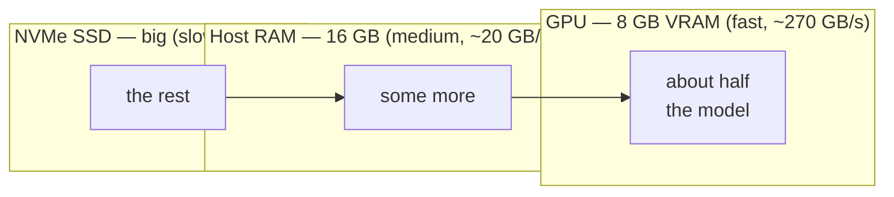
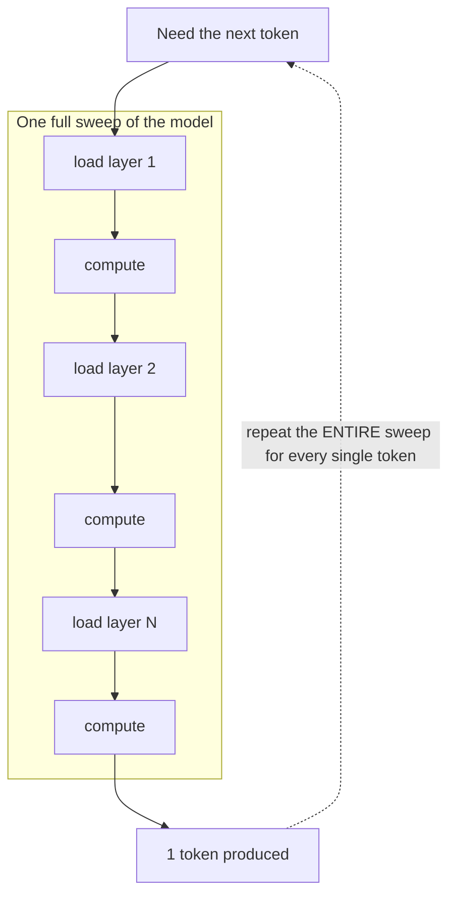
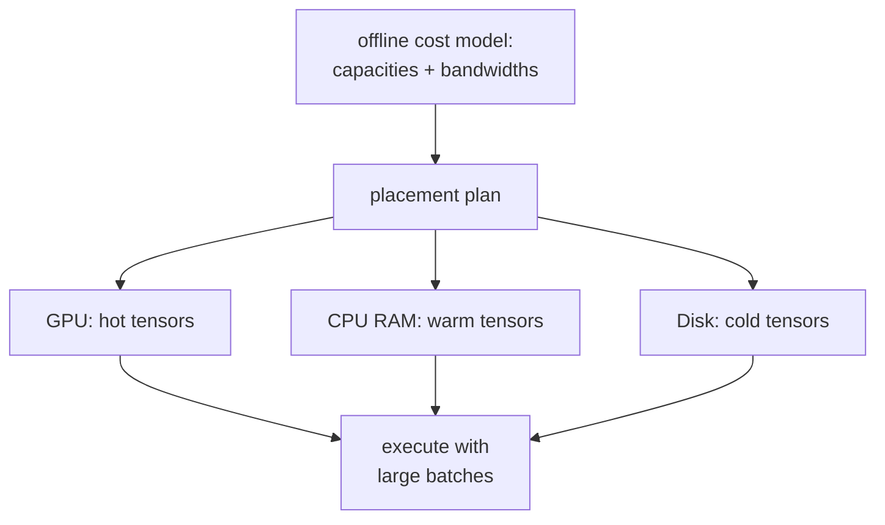
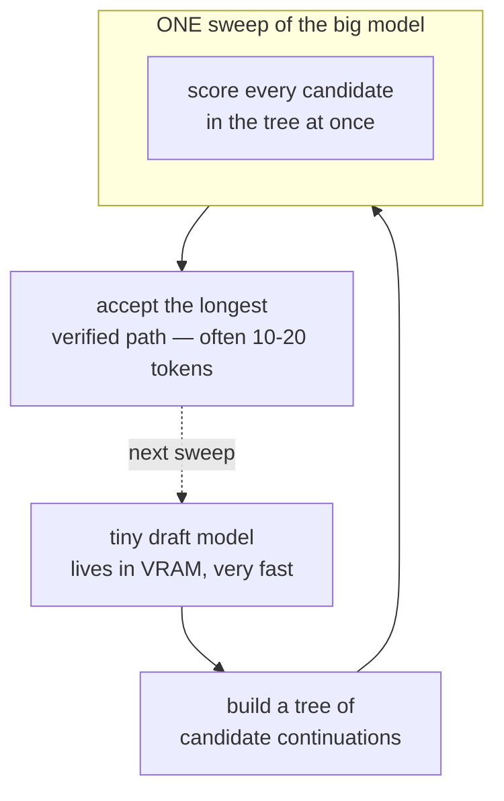
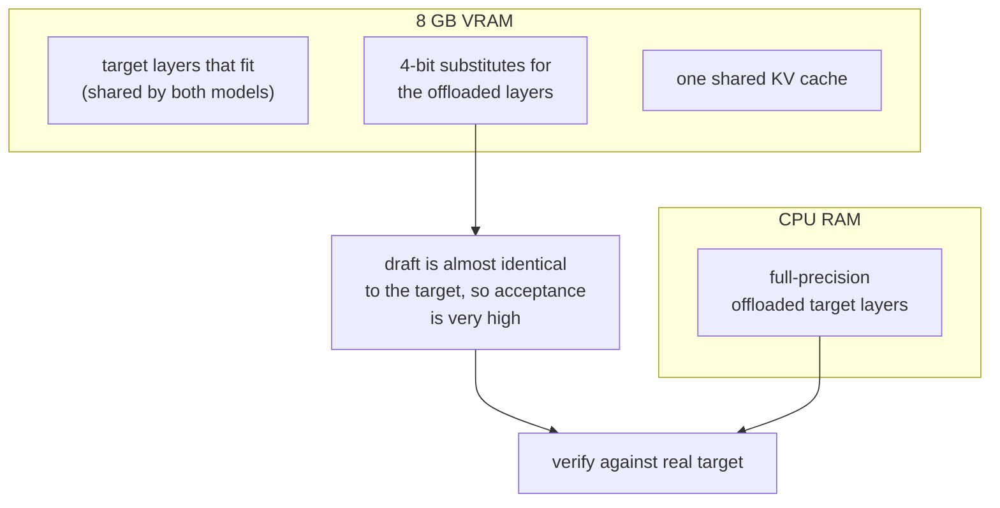
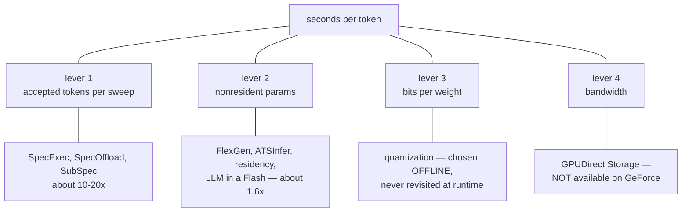
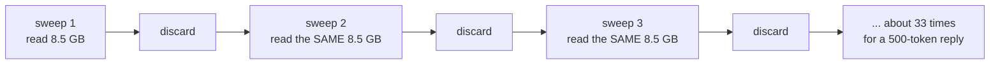

# Literature Review — Running Models Larger Than VRAM

Survey through August 2026. Every claim here is sourced; where a number came from
a paper abstract rather than the full text it is marked *(abstract)*.

---

## 1. The problem in one picture

A 27B model at Q4 is ~16 GB. A consumer GPU has 8 GB. The weights do not fit.



Decoding is **memory-bound, not compute-bound**. Producing one token requires
reading every weight once but performs only ~2 FLOPs per parameter. On an 8 GB
consumer GPU the machine can do roughly 100 FLOPs per byte it reads from VRAM,
and roughly 4000 per byte it reads from NVMe.

> **There is about 1000× more spare compute than spare bandwidth.
> Every good method in this field converts spare FLOPs into fewer bytes moved.**

That single sentence organises the whole literature below.

---

## 2. AirLLM — stream one layer at a time

**Idea:** never hold the whole model. Load layer 1, use it, discard it, load
layer 2, and so on. Peak VRAM becomes one layer instead of the whole model.



**What it solves:** capacity. A 70B model runs on 4 GB.

**What it does not solve:** the dotted line. Every token costs a complete
traversal of the weights, so I/O per token equals the whole non-resident model.
AirLLM's own project notes disk loading as the bottleneck. Its prefetching
update reported roughly a 10% improvement *(project notes)*.

**Cost:** `I/O per token ≈ W`.

---

## 3. FlexGen — solve placement with a cost model

**Idea:** don't hand-place anything. Given GPU/CPU/disk capacities and
bandwidths, solve for where each tensor should live to maximise throughput.



**Strength:** principled, and the first system to treat placement as an
optimisation problem rather than a heuristic.

**Limitation for us:** designed around **large-batch throughput** with
heterogeneous CPU/GPU/disk execution, not single-user interactive decoding.

---

## 4. LLM in a Flash — fetch only what will be used

**Idea:** exploit activation sparsity. Predict which neurons will be non-zero and
load only those rows/columns; window and reuse recent activations; lay flash
reads out contiguously.

**Strength:** attacks bytes-transferred directly, the correct target.

**Limitation:** depends on exploitable sparsity. It was built around ReLU-family
activations; modern SwiGLU/GeGLU models are markedly less sparse.

---

## 5. SpecExec — amortise the sweep across many tokens

**This is the conceptual pivot of the whole field.**

**Idea:** a sweep of the big model can score *many* candidate positions for
almost the same I/O cost as one, because the sweep is bandwidth-bound and there
is ~1000× spare compute. So draft a whole tree of candidate continuations with a
tiny model, then verify the entire tree in one sweep.



**Result:** up to ~20 tokens per target-model iteration; 70B on consumer GPUs at
4–6 tok/s with 4-bit weights and RAM offload, up to 10.6× over autoregressive
decoding *(paper)*.

**Cost:** `I/O per accepted token ≈ W / k`, with `k ≈ 10–20`.

**Critically for us:** SpecExec explicitly covers **SSD** offload, and already
reports that longer offload paths (SSD, or fp16 weights) work best with *larger*
draft-token budgets. Any claim that "the NVMe regime needs bigger trees" is
restating SpecExec.

---

## 6. SpecOffload — put the draft model in idle VRAM

**Idea:** during offloaded inference the GPU sits idle waiting for weights. Fill
that idle capacity with a draft model and interleave drafting with target
streaming, so drafting is effectively free.

**Result:** 2.54× throughput improvement *(abstract)*. Offload tier: CPU RAM.

---

## 7. SubSpec — build the draft *out of* the target

**The strongest published result at our exact operating point.**

**Idea:** acceptance rate is everything, and acceptance is highest when the draft
closely matches the target. So don't use a separate small model — build the draft
from the target itself:

1. **Quantized substitute weights** — cheap data-free 4-bit approximations of the
   offloaded layers, kept entirely in VRAM.
2. **GPU-resident layer sharing** — layers that fit in VRAM are shared verbatim
   between draft and target.
3. **Unified KV cache** — one cache for both, halving KV memory.



**Result:** 9.1× on Qwen2.5-7B under an 8 GB VRAM limit; average 12.5× on
Qwen2.5-32B under 24 GB. Lossless and training-free. NeurIPS 2025.

**This is the baseline to beat.** It already does persistent residency,
speculation, and KV sharing. Offload tier is CPU RAM.

---

## 8. ATSInfer — placement at tensor granularity

**Idea:** layer-level and expert-level placement ignores heterogeneity *within* a
layer. Schedule at tensor granularity instead, with load-aware dynamic transfer
and asynchronous CPU-GPU coordination.

**Result:** up to 1.94× prefill and 3.29× decode over existing systems; ~70%
higher average GPU SM utilisation. ~15k lines of C++ on top of llama.cpp,
evaluated on RTX 3060/4090.

**Takeaway:** static coarse placement leaves a lot on the table. Still an
explicitly hybrid CPU/GPU architecture.

---

## 9. Adjacent lines worth knowing

| Work | Idea | Why it matters here |
|---|---|---|
| **Gated Subspace Inference** (2026) | Split each activation into a subspace component and a residual; gate whether to compute the residual. Offline-calibrated basis, **VRAM bandwidth** target, **lossy** | Closest mechanism to Afterimage — but deployed where weights are already resident, so the gate saves only FLOPs |
| **ASVD / SVD-LLM / IO-SVD** | Activation-aware low-rank weight compression, offline and static | Reports only **10–30%** compression — direct evidence that the composed object is not very low-rank |
| **Any-Precision LLM / AnyBCQ / RRQ** | One checkpoint serving many bit-widths via nested residual bit-planes | Provides the storage layout for progressive fetch. Precision is chosen **statically**; RRQ explicitly is not designed for streaming from disk |
| **MARS** (2026) | Accept draft tokens when the target's top-2 margin is small | Margin as a decision signal — but **lossy**, and changes no I/O |
| **Spec-Spec Decoding** (2026) | Overlap drafting with verification by pre-computing speculations for predicted outcomes | Removes drafting from the critical path |
| **Endor** | Hardware-friendly sparse format for offloaded inference | Storage-format engineering for the same bottleneck |

---

## 10. The landscape on one axis

Write the cost of offloaded decoding as:

```
                    bits_per_weight  x  nonresident_params
seconds per token = ------------------------------------------
                    8 x bandwidth x accepted_tokens_per_sweep
```



**Two structural facts constrain any new work here:**

1. **Lever 1 is crowded and mature.** SubSpec's 9.1× at 8 GB is the number to beat.
2. **GPUDirect Storage does not exist on consumer GeForce cards.** cuFile/GDS is
   H100/H200/B200/B300-class. On an 8 GB GeForce the path is necessarily
   NVMe → pinned host buffer → PCIe → VRAM. There is no CPU-free disk-to-VRAM
   path on the target hardware, and any design assuming one is wrong.

---

## 11. What is genuinely unclaimed *(historical — written for the abandoned Phase-0 bet)*

> **This section describes the subspace-cache hypothesis, which was tested and
> failed** (archive/PHASE0_RESULTS.md). It is kept because the framing of the gap is
> still correct and still motivates the current engine. For the present
> assessment of unclaimed ground, see **§17** below.

Every system in this survey does the same thing at the end of a sweep: it
**discards the weights it just read.** The next sweep re-reads them.



8.5 GB of information; ~280 GB of traffic. **No system in the literature retains
the value of a fetch across sweeps.** That is the gap Afterimage targets — see
[HYPOTHESIS.md](archive/HYPOTHESIS.md) for the mechanism, the mathematics, and an honest
account of why the available evidence on activation rank makes it a risky bet.

---

## 12. Sources

SpecExec arXiv:2406.02532 · SpecOffload arXiv:2505.10259 · SubSpec
arXiv:2509.18344 (NeurIPS 2025) · ATSInfer arXiv:2607.10183 · Gated Subspace
Inference arXiv:2605.03109 · ASVD arXiv:2312.05821 · IO-SVD arXiv:2605.15626 ·
Variance Is Not Importance arXiv:2604.20682 · Dimensional Collapse in Attention
Outputs arXiv:2508.16929 · Mixtures of Subspaces arXiv:2606.16384 · RRQ
arXiv:2608.04048 · AnyBCQ arXiv:2510.10467 · MARS arXiv:2601.15498 ·
Spec-Spec Decoding arXiv:2603.03251 · Lossless but Not Free arXiv:2607.17283 ·
Endor arXiv:2406.11674 · FlexGen, AirLLM, LLM in a Flash (original releases)

---
---

# Part II — Survey update, August 2026

Everything above was written before the lossless streaming engine existed and
before the Phase-0 subspace-cache bet was tested and dropped. Part II is the
current survey: the work that actually bears on where this engine goes next,
with the assessment of what is and isn't still unclaimed brought up to date.

The organising sentence from §1 has not changed, and is worth repeating because
every result below is a variation on it:

> **There is roughly 1000x more spare compute than spare bandwidth. Every good
> method in this field converts spare FLOPs into fewer bytes moved.**

What Part II adds is a second axis: *spare compute is not only on the GPU.*

---

## 13. Lossless weight compression — the codec is a solved problem

| Work | Venue | Ratio | Runs on | Streams from disk |
|---|---|---|---|---|
| **DFloat11** ([2504.11651](https://arxiv.org/pdf/2504.11651)) | NeurIPS'25 | 1.43x | GPU-resident, multi-GPU | no |
| **ZipServ** ([ASPLOS'26](https://www.cse.ust.hk/~weiwa/papers/zipserv-asplos26.pdf)) | ASPLOS'26 | ~1.43x | GPU-resident serving | no |
| **NeuZip** | 2024 | 1.5x | single GPU, runtime memory | no |
| **ZipNN** | 2024 | 1.2-1.5x | checkpoint storage | n/a |
| **Approaching Shannon Bound** ([2606.15789](https://arxiv.org/pdf/2606.15789)) | 2026 | toward ceiling | analysis + rANS | no |
| **Afterimage** (this repo) | — | **1.453x** | single consumer GPU | **yes** |

**DFloat11 is convergent evidence, not competition.** It independently derived
the same insight (bf16 exponents are low-entropy, sign and mantissa are not),
the same technique (Huffman on the exponent field, GPU LUT decode, block-level
decompression), and the same ratio. When two independent efforts land on
1.43-1.45x, that is the number.

**The ceiling is real and close.** The 2026 Shannon-bound work applies context
modelling and rANS to squeeze the remainder; our own entropy measurement puts
the floor at ~10.6 bits/weight (1.51x) and we achieve 1.453x, or 96% of it.
**Nothing in this row of the literature is worth more than another ~4%.**

**ZipServ contributes the one idea still worth taking**: a fused
decompression-GEMM kernel that decodes weights directly into the register files
feeding the Tensor Cores, never materialising them in global memory. Critically,
they found *variable-length Huffman codes are a poor fit for GPU SIMT execution*
and had to redesign around a **fixed-length bitmap format (TCA-TBE)** to make
fusion work. That is a warning label for anyone (including us) planning to fuse
the current codec: expect to trade ratio for fusability.

---

## 14. Heterogeneous CPU/GPU execution — the second pool of spare compute

This is the line of work that has moved most since Part I, and the one most
directly relevant to this engine's next step.

**PowerInfer** ([2312.12456](https://arxiv.org/pdf/2312.12456), SOSP'24) is the
anchor result. Neuron activation follows a power law: a small set of *hot*
neurons fire on almost every input, while *cold* neurons are input-dependent.
PowerInfer preloads hot neurons on the GPU and computes cold ones on the CPU,
reaching 13.2 tok/s average (peak 29.1) on a single RTX 4090. **Caveat for us:**
it depends on ReLU-family activation sparsity. SwiGLU models (Qwen3 included)
are not sparse in that way, so this is not directly portable, and claiming
otherwise would be wrong.

**Dovetail** ([2412.18934](https://arxiv.org/pdf/2412.18934), EMNLP'25) inverts
the usual arrangement: **draft model on the GPU, target model on the CPU**, with
the target doing parallel verification. 1.79-10.1x on 13B models, losslessly.
The lesson is not the specific placement but the principle — the two devices run
*different stages of the same pipeline concurrently* rather than one waiting on
the other.

**Q-Infer**, **APEX**, and **ATSInfer** all attack scheduling. APEX predicts
CPU-side and GPU-side subtask durations and dispatches to maximise overlap,
reporting **11-96% throughput gains**. The recurring failure mode they document
is the one to design against: *long CPU tasks leave the GPU idle and destroy the
benefit of offloading.* Any CPU work must be genuinely concurrent and bounded,
never on the critical path.

**LIA** ([ISCA'25](https://dl.acm.org/doi/full/10.1145/3695053.3731092)) uses
Intel AMX for cooperative CPU-GPU inference. Not applicable to this project's
hardware, but it establishes that CPU matrix throughput is no longer negligible
on recent server parts.

---

## 15. MoE offloading — where 40B-class models become tractable

For a **dense** model, per-token weight traffic equals the whole model; there is
no way around it. For a **Mixture-of-Experts** model, per-token traffic equals
the *activated* experts, and activation is highly skewed — which changes the
arithmetic for 40B-class models completely.

The literature converges on one framing:

> For Mixtral-8x7B, fetching experts over PCIe consumes **98.9% of total time** —
> offloaded MoE inference is fundamentally a data-movement problem.
> ([2511.05814](https://arxiv.org/pdf/2511.05814))

Which is exactly the problem this engine is built for. The main techniques:

| Technique | Systems |
|---|---|
| LRU expert cache | Mixtral-Offloading, AdapMoE |
| LFU expert cache | MoE-Infinity |
| Gate-based prefetch prediction | DAOP, ExpertFlow, [SpecPrefetch](https://arxiv.org/html/2607.24787) |
| Speculative expert prefetch | [MoE-SpeQ](https://arxiv.org/html/2511.14102) |
| CPU-GPU co-scheduling for MoE | HybriMoE (2025) |
| Exploiting expert redundancy | [BuddyMoE](https://arxiv.org/pdf/2511.10054) |
| Importance-driven scheduling | [2508.18983](https://arxiv.org/html/2508.18983v1) |

**None of these compress the experts.** An expert cache holding *losslessly
compressed* experts holds ~1.45x more of them per GB — a direct, unclaimed
composition of this repo's codec with the MoE offloading line.

---

## 16. How fast can a CPU actually decode?

Central to whether CPU-assisted decode is viable, and worth stating with real
numbers rather than intuition.

- Classic inflate (dynamic Huffman): **~1.3-1.4 GB/s** single-threaded.
- SIMD-optimised Huffman (**PivCo-Huffman**): **0.02-0.07 ns/symbol** on modern
  x86/ARM — order 15-50 GB/s/core for byte symbols, on hand-tuned kernels.
- The known hard part: *codeword start positions are not known until the previous
  codeword is decoded*, so naive parallelism is impossible. **Chunked formats
  solve this by construction** — which is precisely what
  `runtime/huffman_chunked.py` already does, for GPU reasons.

**The convenient accident:** the chunk-parallel layout built to make GPU decode
possible is exactly the layout that makes *multicore CPU* decode possible. The
format needs no change to be decoded by either device.

---

## 17. What is unclaimed *now*

Part I's answer ("nobody retains the value of a fetch across sweeps") led to the
subspace-cache bet, which failed on measurement. The current answer is narrower,
better evidenced, and already half-built:

**a. Lossless compression *on the disk-streaming path*.** Every lossless codec
(§13) assumes the model fits in GPU memory. Every disk-streaming system (AirLLM,
ZeRO-Inference, FlexGen) either doesn't compress or isn't lossless. This engine
is the only thing in the intersection, and the measured result is a 1.45-2.0x
speedup over AirLLM at matched or lower VRAM.

**b. Heterogeneous *decode*, not heterogeneous *compute*.** The CPU/GPU
literature (§14) splits *matrix multiplication* across devices. Nobody splits
*entropy decoding* across them — because nobody else has entropy decoding on the
inference path at all. Given §16's throughput numbers and this engine's measured
profile (decode ≈ 13 s/token against disk ≈ 14 s/token, with CPU cores idle),
this is the clearest open opportunity.

**c. A compressed residency tier.** Every offloading system caches *decoded*
weights in host RAM. Caching *compressed* weights fits ~1.45x more model in the
same RAM, trading a little GPU decode for a lot of avoided disk I/O. Trivial to
state; nobody does it, because it requires a decoder on the streaming path.

**d. Compressed MoE expert caching** (§15) — the composition of (a) and (c) that
makes 40B-class models genuinely interesting on 8 GB.

These four are the basis of [PROPOSAL.md](archive/PROPOSAL.md).

Sources for Part II: DFloat11 arXiv:2504.11651 · ZipServ ASPLOS'26 ·
Approaching Shannon Bound arXiv:2606.15789 · PowerInfer arXiv:2312.12456 ·
Dovetail arXiv:2412.18934 · ATSInfer arXiv:2607.10183 · MoE caching analysis
arXiv:2511.05814 · MoE-SpeQ arXiv:2511.14102 · SpecPrefetch arXiv:2607.24787 ·
BuddyMoE arXiv:2511.10054 · Importance-Driven Expert Scheduling arXiv:2508.18983 ·
LIA ISCA'25 · CAM ICDE'25

---
---

# Part III — Adaptive control and reinforcement learning, August 2026

Parts I and II surveyed *what to move and how to encode it*. Part III surveys
*how to decide, at runtime, using feedback* — which is the natural next question
once an engine has as many interacting knobs as this one now does
(`vram_budget_gb`, `ram_budget_gb`, `io_prefetch_depth`, `decode_slice_elems`,
`ram_tier_format`, per-tensor tier assignment, and speculative draft length k).

One structural property of this engine shapes everything below, so it goes first.

## 18. Why learned control is unusually safe *here*

**Every knob in this engine is provably output-invariant.**

- Tier placement (VRAM / RAM / disk) changes *where a weight is read from*,
  never its value.
- `io_prefetch_depth` changes *when* bytes are read.
- `decode_slice_elems` changes how decode work is *chunked* — asserted
  bit-identical across settings in `tests/`.
- Speculative draft length k changes how many tokens are *proposed*; the
  accept/reject/resample step (`runtime/verify.py`) samples the target's exact
  distribution for **any** k, including a badly chosen one.

So a controller exploring this action space can make a token **slower**, never
**wrong**. The reward is pure latency with no accuracy term to trade against.

That is not the usual situation. The entire RL-for-model-compression line —
**ADC**, **DECORE**, **HiReLC** ([2606.26002](https://arxiv.org/pdf/2606.26002),
hierarchical agents assigning per-block pruning/quantization budgets) — has
agents choosing *lossy* configurations, so every exploratory action risks model
quality and the reward must balance size against accuracy. **None of that
machinery is needed here, and none of that risk is taken.** It is worth being
explicit that this line of work is *surveyed and deliberately not adopted*: it
optimizes a tradeoff this project has committed to not making.

The practical consequence: aggressive, adversarially-robust exploration
(EXP3-style) is affordable here in a way it usually is not.

---

## 19. Adaptive speculative decoding — the best-evidenced fit

This is where the literature is strongest, and where this engine's own measured
data most clearly shows headroom.

| Work | Method | Reported gain |
|---|---|---|
| **SpecDec++** ([2405.19715](https://arxiv.org/pdf/2405.19715), ICML'24 / COLM'25) | Candidate length as an **MDP**; trains an acceptance-prediction head on the draft | 2.04x on Alpaca (+7.2% over fixed-k) |
| **BanditSpec** ([2505.15141](https://arxiv.org/pdf/2505.15141), ICML'25) | Multi-armed bandit over speculation hyperparameters (model, window, tree); UCBSpec / EXP3Spec; "stopping time regret" | near-oracle, training-free |
| **GammaTune / GammaTune+** ([2504.00030](https://arxiv.org/pdf/2504.00030)) | Heuristic switching on recent acceptance + exponential smoothing | +15–16% throughput, **reduced variance** |
| **Learning to Draft** ([2603.01639](https://arxiv.org/pdf/2603.01639)) | RL for adaptive drafting | — |
| **Nightjar** ([2512.22420](https://arxiv.org/pdf/2512.22420)) | Dynamic adaptive speculation for serving | — |

Two results matter most for us:

**SpecDec++ proves the shape of the optimal policy.** Formulated as an MDP, the
optimal policy is a **threshold policy**: stop speculating and verify once the
probability that some token will be rejected exceeds a threshold. That is a
strong structural prior — it means we do not need a general policy network, we
need a *good rejection-probability signal and a well-chosen threshold*. A
one-parameter learner is defensible where a deep RL agent would be overkill.

**BanditSpec and GammaTune show training-free methods are enough.** Both get
most of the available gain without training anything, using bandits or smoothed
acceptance statistics. Given this project's constraints (one consumer GPU, no
training infrastructure, and a hard rule against unmeasured complexity), the
training-free branch is the right starting point.

**Our own measured evidence that fixed-k leaves value on the table:** across a
single temperature sweep on the real 14B, draft acceptance ranged **23–41%** and
accepted tokens per sweep ranged **2.67–4.00** (docs/RESULTS_LOG.md). Those are
large swings from one static configuration.

---

## 20. RL for placement, caching and prefetching — the systems line

| Work | Domain | Result |
|---|---|---|
| **Sibyl** ([ISCA'22, 2205.07394](https://arxiv.org/pdf/2205.07394), CMU-SAFARI) | Online RL for **data placement in hybrid storage** | +21.6% / +19.9% over the best prior placement technique |
| **Pythia** | RL data prefetcher for on-chip caches | outperforms hand-designed prefetchers |
| **RL-CoPref** | RL coordination of multiple prefetchers; adjusts **prefetch degree** | — |
| **Hermes** | Perceptron off-chip load predictor | — |
| Cloud-block-storage DRL cache replacement ([TC'23](https://dl.acm.org/doi/abs/10.1109/TC.2023.3325625)) | Learned eviction | — |

**Sibyl is the closest structural analogue to this engine's tier planner** —
"place each item in the best-fit device, adaptively, using online feedback" is
exactly the VRAM/RAM/disk decision. Its stated motivation is also exactly our
situation: prior placement techniques are *rigid*, which limits adaptivity
across workloads and configurations.

But the reason Sibyl works is worth reading carefully before copying it:
**Sibyl gets a reward for every I/O request.** Dense, immediate, per-decision
feedback. Our tier planner, by contrast, makes ~443 placement decisions and then
observes **one** wall-clock number per generation run. That is catastrophic
credit assignment, and it is the difference between "RL applies" and "RL is the
wrong tool" — see §21.

**Pythia / RL-CoPref map cleanly onto `io_prefetch_depth`**, which is a small
discrete action with per-layer feedback (~40 decisions per token) — dense enough
for a bandit, unlike placement.

---

## 21. What this means for Afterimage — honest fit assessment

Sorted by credit-assignment quality, which is what actually determines whether a
learned controller can work:

| Decision | Feedback density | Non-stationary? | Verdict |
|---|---|---|---|
| **Speculative draft length k** | per sweep (~1000s/run) | **yes** — acceptance varies with context | **Strong RL/bandit fit** |
| **Prefetch depth** | per layer (~40/token) | mildly (page-cache state) | Plausible bandit fit, small lever |
| **Tier placement** | **one scalar per run**, 443 decisions | **no** — optimum is fixed per (model, budget) | **RL is the wrong tool** |
| Codec params (chunk_size, max_bits) | compression-time, offline | no | Offline search, not RL |

**The tier-placement row deserves elaboration, because it is where the
temptation to reach for RL is strongest and the argument against is clearest.**

For a fixed model and a fixed budget, the optimal placement does not *change
during the run*. There is nothing to adapt to. What is wrong with the current
planner is not that it fails to learn — it is that its cost model is an
**analytical proxy** rather than a measurement:

```
value_density = compressed_bytes / uncompressed_bytes
```

That proxy assumes traffic-avoided-per-byte is fully determined by compression
ratio. **We have direct evidence it mis-ranks:** measured on the real 14B, a
4 GB budget gave 14.15 s/token and a 6 GB budget gave 14.25 s/token — *more*
residency, no improvement, slightly worse. A model that says "more residency ⇒
strictly less traffic ⇒ faster" does not predict that.

The fix for a wrong cost model is to **measure the costs**, not to bolt a
learner onto a bad objective. Profile per-tensor read and decode time once, solve
the same knapsack against measured costs. That is system identification, and it
is both cheaper and more likely to work than online RL with 443-way credit
assignment from a single scalar.

**This is a real conclusion of the survey, not a hedge:** RL belongs on the
speculation knob, where feedback is dense and the environment genuinely shifts
mid-run. It does not belong on placement, where the honest gap is measurement.

The concrete plan built on this assessment — including the one place where the
two interact in a way nobody in the literature has tuned jointly — is
[PROPOSAL_ADAPTIVE.md](archive/PROPOSAL_ADAPTIVE.md).

Sources for Part III: SpecDec++ arXiv:2405.19715 · BanditSpec arXiv:2505.15141 ·
GammaTune arXiv:2504.00030 · Learning to Draft arXiv:2603.01639 · Nightjar
arXiv:2512.22420 · Sibyl arXiv:2205.07394 (ISCA'22) · HiReLC arXiv:2606.26002 ·
Pythia, RL-CoPref, Hermes (CMU-SAFARI intelligent-memory line) · DRL cache
replacement IEEE TC 2023
