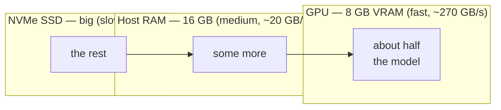
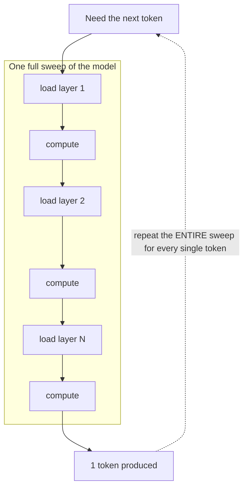
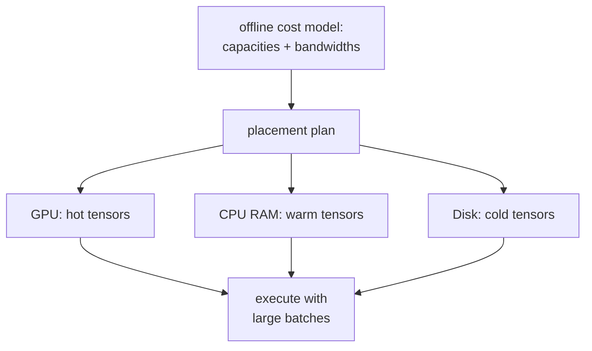
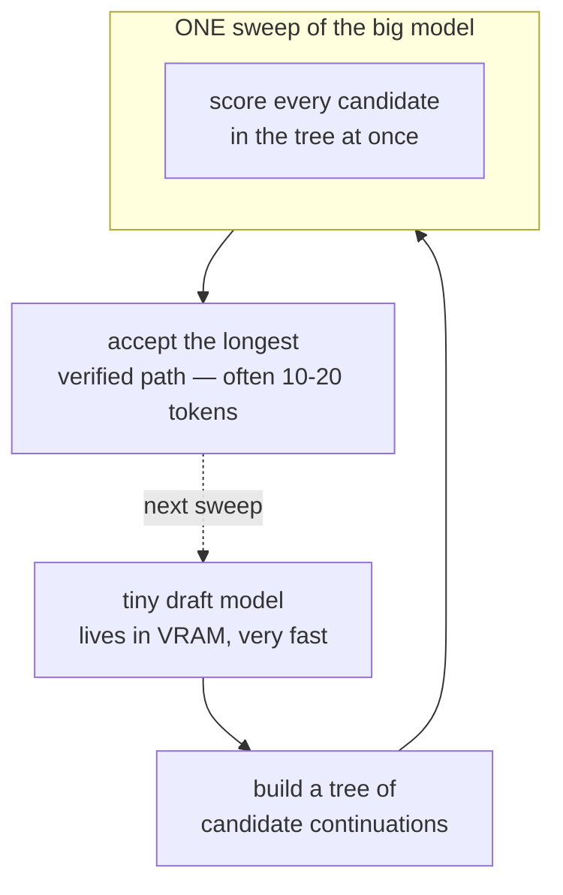
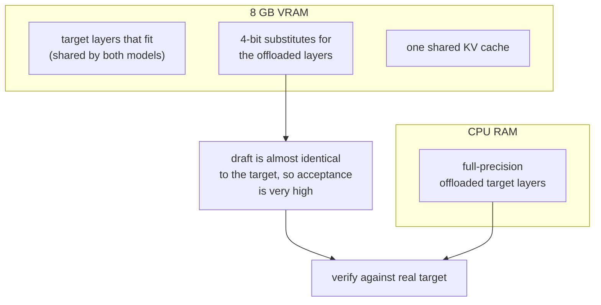
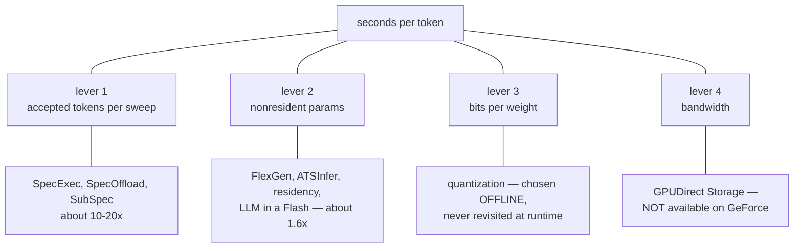
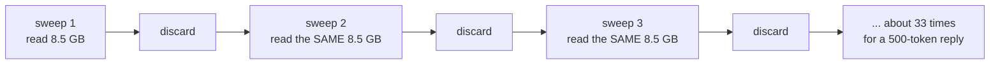

# Literature Review — Running Models Larger Than VRAM

Survey through August 2026. Every claim here is sourced; where a number came from
a paper abstract rather than the full text it is marked *(abstract)*.

---

## 1. The problem in one picture

A 27B model at Q4 is ~16 GB. A consumer GPU has 8 GB. The weights do not fit.



Decoding is **memory-bound, not compute-bound**. Producing one token requires
reading every weight once but performs only ~2 FLOPs per parameter. On an 8 GB
consumer GPU the machine can do roughly 100 FLOPs per byte it reads from VRAM,
and roughly 4000 per byte it reads from NVMe.

> **There is about 1000× more spare compute than spare bandwidth.
> Every good method in this field converts spare FLOPs into fewer bytes moved.**

That single sentence organises the whole literature below.

---

## 2. AirLLM — stream one layer at a time

**Idea:** never hold the whole model. Load layer 1, use it, discard it, load
layer 2, and so on. Peak VRAM becomes one layer instead of the whole model.



**What it solves:** capacity. A 70B model runs on 4 GB.

**What it does not solve:** the dotted line. Every token costs a complete
traversal of the weights, so I/O per token equals the whole non-resident model.
AirLLM's own project notes disk loading as the bottleneck. Its prefetching
update reported roughly a 10% improvement *(project notes)*.

**Cost:** `I/O per token ≈ W`.

---

## 3. FlexGen — solve placement with a cost model

**Idea:** don't hand-place anything. Given GPU/CPU/disk capacities and
bandwidths, solve for where each tensor should live to maximise throughput.



**Strength:** principled, and the first system to treat placement as an
optimisation problem rather than a heuristic.

**Limitation for us:** designed around **large-batch throughput** with
heterogeneous CPU/GPU/disk execution, not single-user interactive decoding.

---

## 4. LLM in a Flash — fetch only what will be used

**Idea:** exploit activation sparsity. Predict which neurons will be non-zero and
load only those rows/columns; window and reuse recent activations; lay flash
reads out contiguously.

**Strength:** attacks bytes-transferred directly, the correct target.

**Limitation:** depends on exploitable sparsity. It was built around ReLU-family
activations; modern SwiGLU/GeGLU models are markedly less sparse.

---

## 5. SpecExec — amortise the sweep across many tokens

**This is the conceptual pivot of the whole field.**

**Idea:** a sweep of the big model can score *many* candidate positions for
almost the same I/O cost as one, because the sweep is bandwidth-bound and there
is ~1000× spare compute. So draft a whole tree of candidate continuations with a
tiny model, then verify the entire tree in one sweep.



**Result:** up to ~20 tokens per target-model iteration; 70B on consumer GPUs at
4–6 tok/s with 4-bit weights and RAM offload, up to 10.6× over autoregressive
decoding *(paper)*.

**Cost:** `I/O per accepted token ≈ W / k`, with `k ≈ 10–20`.

**Critically for us:** SpecExec explicitly covers **SSD** offload, and already
reports that longer offload paths (SSD, or fp16 weights) work best with *larger*
draft-token budgets. Any claim that "the NVMe regime needs bigger trees" is
restating SpecExec.

---

## 6. SpecOffload — put the draft model in idle VRAM

**Idea:** during offloaded inference the GPU sits idle waiting for weights. Fill
that idle capacity with a draft model and interleave drafting with target
streaming, so drafting is effectively free.

**Result:** 2.54× throughput improvement *(abstract)*. Offload tier: CPU RAM.

---

## 7. SubSpec — build the draft *out of* the target

**The strongest published result at our exact operating point.**

**Idea:** acceptance rate is everything, and acceptance is highest when the draft
closely matches the target. So don't use a separate small model — build the draft
from the target itself:

1. **Quantized substitute weights** — cheap data-free 4-bit approximations of the
   offloaded layers, kept entirely in VRAM.
2. **GPU-resident layer sharing** — layers that fit in VRAM are shared verbatim
   between draft and target.
3. **Unified KV cache** — one cache for both, halving KV memory.



**Result:** 9.1× on Qwen2.5-7B under an 8 GB VRAM limit; average 12.5× on
Qwen2.5-32B under 24 GB. Lossless and training-free. NeurIPS 2025.

**This is the baseline to beat.** It already does persistent residency,
speculation, and KV sharing. Offload tier is CPU RAM.

---

## 8. ATSInfer — placement at tensor granularity

**Idea:** layer-level and expert-level placement ignores heterogeneity *within* a
layer. Schedule at tensor granularity instead, with load-aware dynamic transfer
and asynchronous CPU-GPU coordination.

**Result:** up to 1.94× prefill and 3.29× decode over existing systems; ~70%
higher average GPU SM utilisation. ~15k lines of C++ on top of llama.cpp,
evaluated on RTX 3060/4090.

**Takeaway:** static coarse placement leaves a lot on the table. Still an
explicitly hybrid CPU/GPU architecture.

---

## 9. Adjacent lines worth knowing

| Work | Idea | Why it matters here |
|---|---|---|
| **Gated Subspace Inference** (2026) | Split each activation into a subspace component and a residual; gate whether to compute the residual. Offline-calibrated basis, **VRAM bandwidth** target, **lossy** | Closest mechanism to Afterimage — but deployed where weights are already resident, so the gate saves only FLOPs |
| **ASVD / SVD-LLM / IO-SVD** | Activation-aware low-rank weight compression, offline and static | Reports only **10–30%** compression — direct evidence that the composed object is not very low-rank |
| **Any-Precision LLM / AnyBCQ / RRQ** | One checkpoint serving many bit-widths via nested residual bit-planes | Provides the storage layout for progressive fetch. Precision is chosen **statically**; RRQ explicitly is not designed for streaming from disk |
| **MARS** (2026) | Accept draft tokens when the target's top-2 margin is small | Margin as a decision signal — but **lossy**, and changes no I/O |
| **Spec-Spec Decoding** (2026) | Overlap drafting with verification by pre-computing speculations for predicted outcomes | Removes drafting from the critical path |
| **Endor** | Hardware-friendly sparse format for offloaded inference | Storage-format engineering for the same bottleneck |

---

## 10. The landscape on one axis

Write the cost of offloaded decoding as:

```
                    bits_per_weight  x  nonresident_params
seconds per token = ------------------------------------------
                    8 x bandwidth x accepted_tokens_per_sweep
```



**Two structural facts constrain any new work here:**

1. **Lever 1 is crowded and mature.** SubSpec's 9.1× at 8 GB is the number to beat.
2. **GPUDirect Storage does not exist on consumer GeForce cards.** cuFile/GDS is
   H100/H200/B200/B300-class. On an 8 GB GeForce the path is necessarily
   NVMe → pinned host buffer → PCIe → VRAM. There is no CPU-free disk-to-VRAM
   path on the target hardware, and any design assuming one is wrong.

---

## 11. What is genuinely unclaimed

Every system in this survey does the same thing at the end of a sweep: it
**discards the weights it just read.** The next sweep re-reads them.



8.5 GB of information; ~280 GB of traffic. **No system in the literature retains
the value of a fetch across sweeps.** That is the gap Afterimage targets — see
[HYPOTHESIS.md](HYPOTHESIS.md) for the mechanism, the mathematics, and an honest
account of why the available evidence on activation rank makes it a risky bet.

---

## 12. Sources

SpecExec arXiv:2406.02532 · SpecOffload arXiv:2505.10259 · SubSpec
arXiv:2509.18344 (NeurIPS 2025) · ATSInfer arXiv:2607.10183 · Gated Subspace
Inference arXiv:2605.03109 · ASVD arXiv:2312.05821 · IO-SVD arXiv:2605.15626 ·
Variance Is Not Importance arXiv:2604.20682 · Dimensional Collapse in Attention
Outputs arXiv:2508.16929 · Mixtures of Subspaces arXiv:2606.16384 · RRQ
arXiv:2608.04048 · AnyBCQ arXiv:2510.10467 · MARS arXiv:2601.15498 ·
Spec-Spec Decoding arXiv:2603.03251 · Lossless but Not Free arXiv:2607.17283 ·
Endor arXiv:2406.11674 · FlexGen, AirLLM, LLM in a Flash (original releases)
